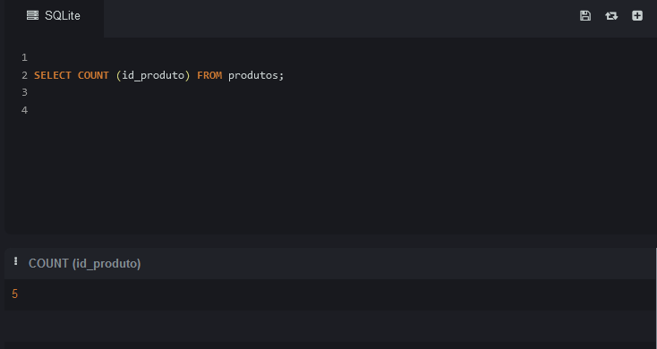
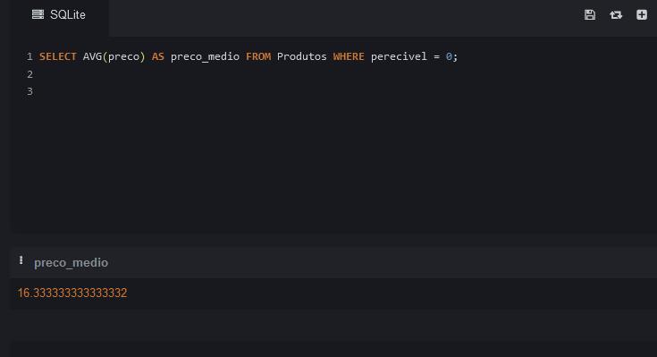
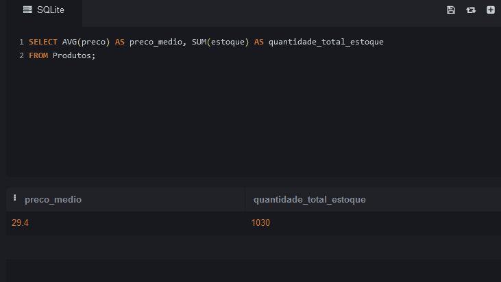
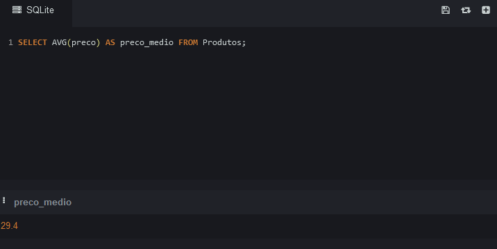
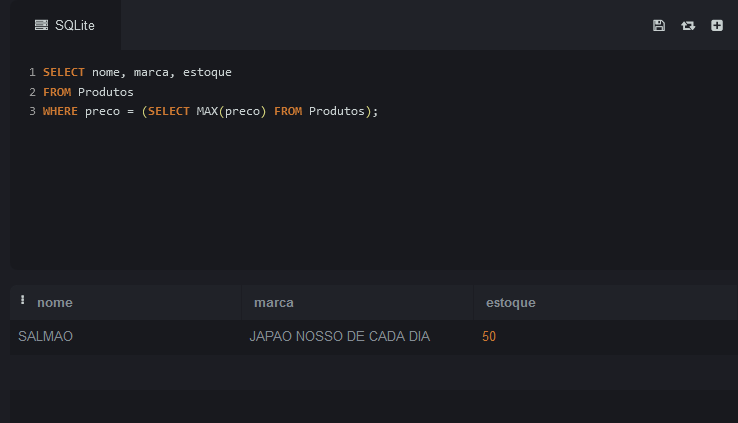

# AGRUPAMENTO-E-AGREGAÇÃO

CONTAGEM DOS PRODUTOS

FILTRANDO PRODUTOS PELA NACIONALIDADE

MEDIA DOS PRODUTOS COM WHERE (FILTRO)

MEDIA E QUANTIDADE TOTAL EM ESTOQUE

MEDIA DOS PRODUTOS

SELECIONANDO PRODUTO COM MAIOR PREÇO, E EXIBINDO TODOS OS FILTROS

