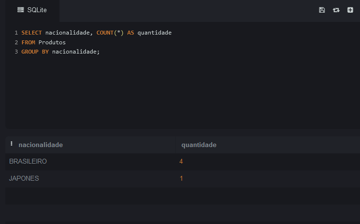

# AGRUPAMENTO-E-AGREGAÇÃO

CONTAGEM DOS PRODUTOS

FILTRANDO PRODUTOS PELA NACIONALIDADE

MEDIA DOS PRODUTOS COM WHERE (FILTRO)

MEDIA DOS PRODUTOS

MEDIA E QUANTIDADE TOTAL EM ESTOQUE

SELECIONANDO PRODUTO COM MAIOR PREÇO, E EXIBINDO TODOS OS FILTROS

SQL
[Link Para Verificar o SQL](https://github.com/Leon14789/AGRUPAMENTO-E-AGREGA--O/blob/master/SQL.txt)

